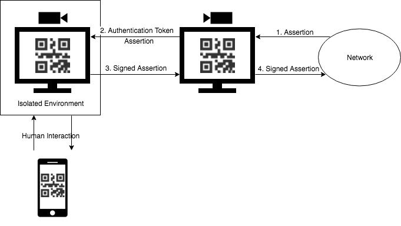

# Master Thesis - A Secure, Isolated and Air-Gapped Signing System


## System Overview:
The following picture shows an overview of how the two systems work together.


(Step 2 and 3 might be encoded within the same QR-code)


## Run the server
In order to start the signer, run the
```console
node code/signer/bin/www
```

To run the signee, run
```console
node code/signee/bin/www
```

and then connect to `localhost:3000`.
