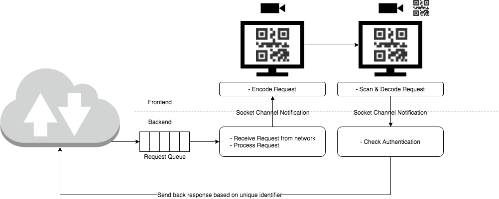

# The Signee
The Signee receives requests from the network, generates a QR-Code and displays it on the screen. Then it scans the screen of the signer to receive the answer, decodes the answer and sends it back to the network.

The following is a first sketch of how the design of **the signee** could looks like.

