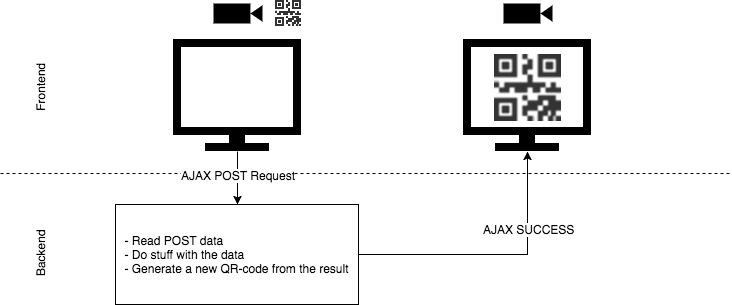

# The Signer

The Signer is the first part of the system. It is the machine that is, in the ideal case, in a complete isolated environment. The signer is responsible for signing incoming requests.

The following is a first sketch of how the design of **the signer** could looks like.

