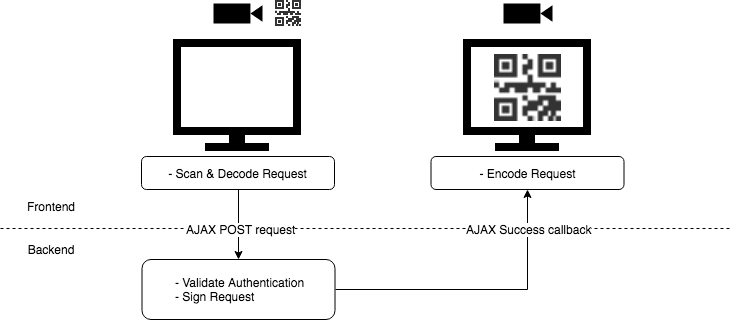

# The Signer

The Signer is the first part of the system. It is the machine that is, in the ideal case, in a complete isolated environment. The Signer is responsible for signing incoming requests.

The following shows a high-level overview on how the Signer works. It also shows the interaction between the backend and the frontend.

